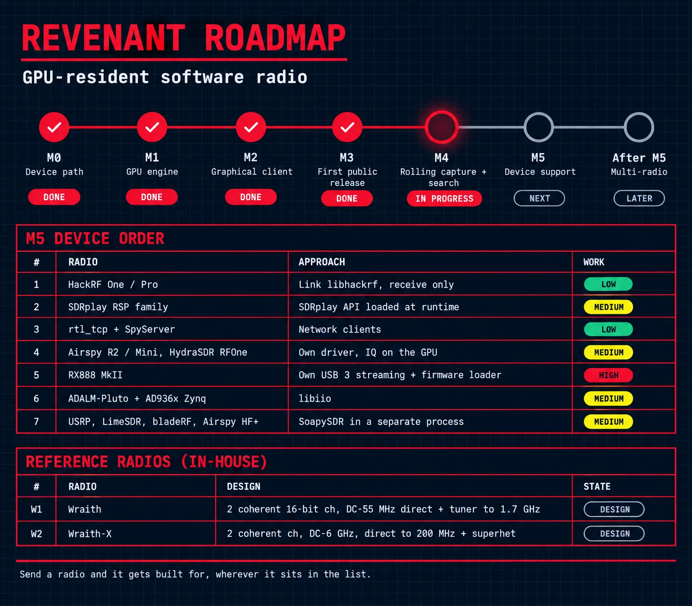

<div align="center">


# Revenant

**Samples land in GPU memory once, and the whole radio runs there.**

[](https://github.com/Locke-Werks/Revenant/releases)
[](LICENSE)
[](#requirements)

</div>

---

Software radio on a CPU spends most of its time moving samples. The device
hands them to the host, the host copies them into a chain, each stage reads and
writes them again, and the display gets whatever survives the budget. That
shape has a consequence people stop noticing: you have to decide what you are
listening to before the samples arrive. Tune somewhere, demodulate one thing,
and everything else in the band that moment goes past unrecorded.

Revenant moves the whole chain onto the GPU and leaves the samples there.

## Roadmap



M0 to M3 are done, M4 (rolling capture and search) is in progress, and M5 adds
radios beyond the RTL-SDR. [docs/roadmap.md](docs/roadmap.md) has the table and
the reasons for the device order.

## Reference hardware

Two receivers are being designed in house as reference radios for Revenant:

- **Wraith**, two coherent 16-bit channels sampling DC to about 55 MHz
  directly, a tuner tier to 1.7 GHz, real preselection and a hardware overload
  loop, at about $850 in parts. The one being built first.
- **Wraith-X**, the full design: two coherent channels from DC to 6 GHz, direct
  sampling to 200 MHz and a superheterodyne above it, every raw sample to the
  GPU over PCIe.

Both are at the architecture stage. [docs/hardware.md](docs/hardware.md) has the
design.

## What it is

A software defined radio application where samples cross the bus once, into
device memory, and every stage after that is a compute shader operating on
buffers that never come back. Tuning, filtering, decimation, demodulation and
decoding all run on the device. The host schedules work and reads out results.

The engine is Vulkan compute, written against the API rather than against a
vendor's toolkit, so the same kernels are meant to run on NVIDIA, AMD and
Intel hardware. Every kernel has a CPU reference implementation, and a
conformance suite diffs the two on the device it is pointed at; CI points it at
an RTX 4090, the one device this project supports and tests today. That suite
is the first thing the
project built, before anything user-facing, because a signal processing engine
whose numbers nobody has checked is an engine that produces confident garbage.

## What that buys

**A second channel is cheap.** Demodulating another signal in the same
bandwidth means dispatching more work over samples that are already resident,
not another pass across the bus. The cost of a channel is the arithmetic it
needs, and nothing else.

**The capture persists, so tuning can happen afterwards.** Samples that stay in
device memory and spill to disk as raw IQ are a record of the whole bandwidth,
not of the one signal somebody chose at the time. Going back into last
Tuesday's capture and demodulating something nobody was listening to is an
ordinary operation rather than a lost opportunity. This is why time in the
engine is an exact sample index from the start of the stream and never a
floating-point timestamp.

**A capture is something you can search.** Once the band is stored rather than
consumed, detection runs over it: find every burst, every carrier that came up
and went away, every transmission matching a shape. The question moves from
"what is on this frequency right now" to "what happened in this band, and
when".

Those are the design's reasons for existing. None of them is a benchmark. What
has been measured is in [docs/status.md](docs/status.md), with the numbers
rather than the adjectives.

## Quick start

```
revenant-cli "rtlsdr://0?freq=98.1M&rate=2400000&gain=20"     --vrx 98.1M:wfm:200k --play --record fm.wav

revenant-cli "rtlsdr://0?freq=98.1M&rate=2400000&gain=20"     --spectrum --detect
```

The first plays and records broadcast FM; the second draws the span as a
waterfall in the terminal and lists what the detector finds. Most people want
the Qt client instead, which the installer puts in the Start Menu.
[docs/status.md](docs/status.md) has what works today, what does not, and what
has been measured.

## Requirements

Windows 11, x64.

A GPU with Vulkan 1.3 or newer. The one device tested is an NVIDIA RTX 4090,
which is what development and CI run against. Other Vulkan 1.3 devices may
work and are not tested. The integrated Radeon in a Ryzen 9 7950X is not
supported: its driver corrupts the spectrum kernel, as
[docs/status.md](docs/status.md) says.

An SDR device, optionally: an RTL-SDR v3 works today, through librtlsdr. The
synthetic wideband source and the file source need no hardware at all and are
what the conformance suite runs against, so the engine is fully exercisable
without a radio.

A sound card, if you want to listen rather than record. The monitor is
WASAPI in shared mode.

For speech to text, 1.6 GB free in `%LOCALAPPDATA%` and a network connection
the first time it is turned on, when the engine downloads Whisper's model and
verifies it. Nothing is fetched before then, or again once it is verified.

macOS and Linux are not targets yet. The engine is written to the Vulkan API
and does not use Windows-specific graphics, but nobody has built or run it
elsewhere, and claiming a platform nobody has tested is how a project acquires
bug reports it cannot answer.

## Install

`Revenant-Setup.exe` from the
[release page](https://github.com/Locke-Werks/Revenant/releases). It installs
for all users into `Program Files\Revenant`, so it asks for administrator
rights, and adds a Start Menu entry for the client. Unattended, `/S`, with
`/O:desktop_shortcut=on` for a desktop shortcut, which is off by default.

The Start Menu entry opens the client, and the client starts the engine
beside it when none is answering on port 17690. Pick your radio in the
client's radio panel, which opens by itself the first time; after that the
client reopens the last radio you used. An engine the client started stops
when the client does. One you started yourself, a headless recorder for
instance, is left alone:

```
"C:\Program Files\Revenant\revenant-engine.exe" "rtlsdr://0?freq=98.1M&rate=2400000&gain=20"
```

The same release page carries the source for everything the installer
ships: `Revenant-<version>-corresponding-source.zip` for Revenant, libusb and
librtlsdr, and the Qt and FFmpeg source archives with `SOURCES-client.txt`
saying what each one is.

## Build

`cmake --preset vs`, then `cmake --build --preset vs`. Visual Studio 2022, CMake
4.3, the LunarG Vulkan SDK and vcpkg.

[docs/building.md](docs/building.md) has the full list, the preset table, how to
point the suite at a particular GPU, and two traps involving a Strawberry Perl
installation that have each cost an afternoon.

## Documentation

Using it:

- [docs/status.md](docs/status.md), what works, what does not, and what has been measured
- [docs/roadmap.md](docs/roadmap.md), milestones and the order radios will be supported in
- [docs/hardware.md](docs/hardware.md), the Wraith and Wraith-X reference radios
- [docs/ui-spectrum.md](docs/ui-spectrum.md), the client: windows, keys, receiver rack,
  spectrum and waterfall scaling, AFT, the auto filter, the decode log and captions
- [docs/modes.md](docs/modes.md), every mode, what each needs and which are out of reach
- [docs/sensitivity.md](docs/sensitivity.md), each decoder's sensitivity in white noise
- [docs/detection.md](docs/detection.md), wideband detection, click-to-tune and auto DV
- [docs/noise.md](docs/noise.md), the impulse blanker, notches and noise reduction
- [docs/calibration.md](docs/calibration.md), frequency correction, DC removal and I/Q correction
- [docs/plugins.md](docs/plugins.md), engine plugins, including the P25 trunk tracker
- [docs/ambe.md](docs/ambe.md), why DMR and D-STAR voice need a vocoder plugin
- [docs/recordings.md](docs/recordings.md), the IQ recordings the engine reads

How it is built:

- [docs/building.md](docs/building.md), prerequisites, presets and device selection
- [docs/conventions.md](docs/conventions.md), the rules the code follows and why
- [docs/rpc.md](docs/rpc.md), why the client is a second process, the wire, and speech to text
- [docs/fft.md](docs/fft.md), why the FFT is written here, with the measurements
- [docs/gpu-conformance.md](docs/gpu-conformance.md), the GPU-against-CPU suite and vendor coverage
- [docs/ci.md](docs/ci.md), why the GPU jobs are self-hosted and what the matrix covers
- [docs/snr-convention.md](docs/snr-convention.md), how SNR is reported
- [docs/packaging.md](docs/packaging.md), the installer and what goes into it

Licensing and provenance:

- [docs/clean-room.md](docs/clean-room.md), the clean-room policy and its one exception
- [docs/rtlsdr-provenance.md](docs/rtlsdr-provenance.md), why the RTL-SDR settled the licence
- [docs/license.md](docs/license.md), how the project came to be GPL-3.0
- [docs/rds-first-decode.md](docs/rds-first-decode.md), the first decode of an off-air signal
- [CONTRIBUTING.md](CONTRIBUTING.md) and [CLA.md](CLA.md), contributing and the contributor agreement

## License

GPL-3.0-or-later, because librtlsdr is the only practical path to an RTL2832U
and it is GPL-2.0-or-later. See [LICENSE](LICENSE) and
[docs/license.md](docs/license.md). Every release page carries the
corresponding source beside the installer.

Copyright (c) 2026 Locke Werks.
